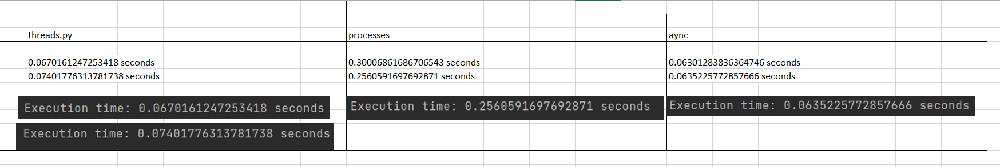

# Лабораторная работа 2
## Цель лабораторной работы
Понять отличия потоками и процессами и понять, что такое ассинхронность в Python.
##Описание работы (разработка платформы для поиска людей в команду)
Работа о потоках, процессах и асинхронности поможет студентам развить навыки создания эффективных и быстродействующих программ, что важно для работы с большими объемами данных и выполнения вычислений. 
Этот опыт также подготавливает студентов к реальным проектам, где требуется использование многопоточности и асинхронности для эффективной обработки данных или взаимодействия с внешними сервисами.
## Задание 1
Напишите три различных программы на Python, использующие каждый из подходов: threading, multiprocessing и async. Каждая программа должна решать считать сумму всех чисел от 1 до 1000000. Разделите вычисления на несколько параллельных задач для ускорения выполнения.
### threads.py
    import threading
    
    def calculate_sum(start, end):
    total = 0
    for i in range(start, end):
        total += i
    return total
    
    def main():
    num_threads = 4
    chunk_size = 1000000 // num_threads
    threads = []
    results = []
    
    for i in range(num_threads):
        start = i * chunk_size + 1
        end = (i + 1) * chunk_size + 1
        thread = threading.Thread(target=lambda: results.append(calculate_sum(start, end)))
        threads.append(thread)
        thread.start()
    
    for thread in threads:
        thread.join()
    
    final_result = sum(results)
    print(final_result)
    
    if __name__ == "__main__":
    import time
    
    start_time = time.time()
    main()
    end_time = time.time()
    execution_time = end_time - start_time
    print(f"Execution time: {execution_time} seconds")
### processes.py
    from multiprocessing import Pool
    
    
    def calculate_sum(args):
        start, end = args
        total = 0
        for i in range(start, end):
            total += i
        return total
    
    def distribution_pool():
        p = Pool(4)
        result = sum(p.imap(calculate_sum, [[1, 250001], [250001, 500001], [500001, 750001], [750001, 1000001]]))
        return result
    
    if __name__ == "__main__":
        import time
    
        start_time = time.time()
        distribution_pool()
        end_time = time.time()
        execution_time = end_time - start_time
        print(f"Execution time: {execution_time} seconds")

### asynchronus.py
    import asyncio
    
    async def calculate_sum(start, end):
        total = 0
        for i in range(start, end):
            total += i
        return total
    
    async def main():
        num_tasks = 4
        chunk_size = 1000000 // num_tasks
        tasks = []
    
        for i in range(num_tasks):
            start = i * chunk_size + 1
            end = (i + 1) * chunk_size + 1
            task = asyncio.create_task(calculate_sum(start, end))
            tasks.append(task)
    
        results = await asyncio.gather(*tasks)
        final_result = sum(results)
        print(final_result)
    
    if __name__ == "__main__":
        import time
    
        start_time = time.time()
        asyncio.run(main())
        end_time = time.time()
        execution_time = end_time - start_time
        print(f"Execution time: {execution_time} seconds")
## Полученные результаты по времени:

##Вывод
Программа, использующая асинхронность, завершается быстрее всего.  Программа, использующая мультипроцессы, завершается медленнее, чем программа с потоками.Это может быть связано с накладными расходами на создание и управление процессами.

##Задача 2. Параллельный парсинг веб-страниц с сохранением в базу данных
 Напишите программу на Python для параллельного парсинга нескольких веб-страниц с сохранением данных в базу данных с использованием подходов threading, multiprocessing и async. Каждая программа должна парсить информацию с нескольких веб-сайтов, сохранять их в базу данных.
 
### threads.py

    
    def parse_and_save(url):
        response = requests.get(url)
        soup = BeautifulSoup(response.text, 'html.parser')
        title = soup.title.string
    
        # Соединение с базой данных
        conn = psycopg2.connect("dbname=baza3 user=moni password=123 host=localhost")
        cur = conn.cursor()
    
        # Сохранение заголовка в базу данных
        cur.execute("INSERT INTO pages_1 (url, title) VALUES (%s, %s)", (url, title))
        conn.commit()

        print(f"Title of {url}: {title}")
    
        cur.close()
        conn.close()
    
    def main():
        urls = ["https://platffin.com", "https://lamoda.ru", "https://olsi-trade.ru"]
        threads = []
    
        for url in urls:
            thread = Thread(target=parse_and_save, args=(url,))
            threads.append(thread)
            thread.start()
    
        for thread in threads:
            thread.join()
    
    if __name__ == "__main__":
        #main()
        import time
    
        start_time = time.time()
        main()
        end_time = time.time()
        execution_time = end_time - start_time
        print(f"Execution time: {execution_time} seconds")

### processing.py
    def parse_and_save(url):
        response = requests.get(url)
        soup = BeautifulSoup(response.text, 'html.parser')
        title = soup.title.string
    
        # Соединение с базой данных
        conn = psycopg2.connect("dbname=baza3 user=moni password=123 host=localhost")
        cur = conn.cursor()
    
        # Сохранение заголовка в базу данных
        cur.execute("INSERT INTO pages (url, title) VALUES (%s, %s)", (url, title))
        conn.commit()
    
        print(f"Title of {url}: {title}")
    
        cur.close()
        conn.close()
    
    def main():
        urls = ["https://platffin.com", "https://lamoda.ru", "https://olsi-trade.ru"]
        processes = []
    
        for url in urls:
            process = Process(target=parse_and_save, args=(url,))
            processes.append(process)
            process.start()
    
        for process in processes:
            process.join()
    
    if __name__ == "__main__":
        import time
    
        start_time = time.time()
        main()
        end_time = time.time()
        execution_time = end_time - start_time
        print(f"Execution time: {execution_time} seconds")
### asynchronus.py
    def create_aiohttp_session():
        return aiohttp.ClientSession()
    
    
    async def parse_and_save(url, session):
        async with session.get(url) as response:
            html = await response.text()
            soup = BeautifulSoup(html, 'html.parser')
            title = soup.title.string
    
            # Соединение с базой данных
            conn = psycopg2.connect("dbname=baza3 user=moni password=123 host=localhost")
            cur = conn.cursor()
    
            # Сохранение заголовка в базу данных
            cur.execute("INSERT INTO pages_2 (url, title) VALUES (%s, %s)", (url, title))
            conn.commit()
    
            print(f"Title of {url}: {title}")
    
            cur.close()
            conn.close()
    
    
    async def main():
        urls = ["https://platffin.com", "https://lamoda.ru", "https://olsi-trade.ru"]
        tasks = []
    
        async with create_aiohttp_session() as session:
            for url in urls:
                task = asyncio.create_task(parse_and_save(url, session))
                tasks.append(task)
    
            await asyncio.gather(*tasks)
    
    
    if __name__ == "__main__":
        import time
    
        start_time = time.time()
        asyncio.run(main())
        end_time = time.time()
        execution_time = end_time - start_time
        print(f"Execution time: {execution_time} seconds")

## Полученные записи

## Полученные результаты по времени:

##Вывод
Программа, использующая асинхронность, завершается быстрее всего.  Программа, использующая мультипроцессы, завершается медленнее, чем программа с потоками.Это может быть связано с накладными расходами на создание и управление процессами.

Асинхронность обычно работает быстрее благодаря способности программы выполнять несколько задач без блокировки потока исполнения. В остальных случаях выполнения задачи обычно выполняются последовательно: одна задача начинается только после завершения предыдущей. В таком случае, если одна из задач занимает много времени на ожидание ввода-вывода или другой медленной операции, все последующие задачи также останавливаются.

##Вывод
В рамках данной лабораторной работы были получены навыки по реализации многопоточности, мультипроцессности, асинхронности с использованием подходов threading, multiprocessing и async . Был получен опыт по реализации потоков.